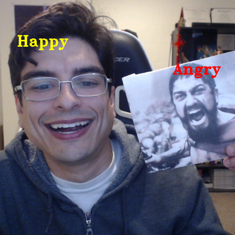
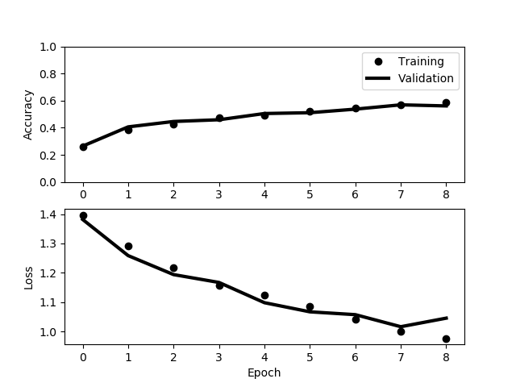

# Real Time Facial Expression Classification


[Face perception](https://en.wikipedia.org/wiki/Face_perception) is one of the most important daily cognitive tasks that humans perform.  This is such an important function that facial expertise is even represented within the brain's [modular layout](https://en.wikipedia.org/wiki/Fusiform_face_area).

Under [neurotypical](https://en.wikipedia.org/wiki/Neurotypical) conditions this task is accomplished relatively easily, however, individuals with [autism spectrum disorder](https://en.wikipedia.org/wiki/Autism_spectrum) or [schizophrenia](https://en.wikipedia.org/wiki/Schizophrenia) both have increased difficulty with face classification.

Advances in [computer vision](https://en.wikipedia.org/wiki/Computer_vision) algorithms have resulted in the possibility of assisting these individuals with the task of face perception!  This tech demo demonstrates how such methods could assist in emotion perception!

The provided model was trained on a set of 13312 48x48 grayscale face images evenly split across four emotion categories: angry, sad, happy, and neutral.  These images were scraped from various stock image websites and sourced from psychophysics stimuli used in my [academic research](http://insalubrio.us/science.php).

<p align="center">

</p>

Face tracking in the live video demonstration is accomplished using [dlib's](http://dlib.net/) CNN face classifier as it is extremely fast and far more robust than using [Haar cascades](https://en.wikipedia.org/wiki/Haar-like_feature).  As demonstrated above, it handles multiple faces quite effectively!

## Validation

The mathematician [John von Neumann](https://en.wikiquote.org/wiki/John_von_Neumann) famously stated "With four parameters I can fit an elephant and with five I can make him wiggle his trunk."  In other words, it is very easy to over-fit a model when working with a large number of parameters.



With this in mind, loss and accuracy are carefully monitored and training was stopped early at the fifth epoch since training beyond this point results in [over-fitting](https://en.wikipedia.org/wiki/Overfitting).

## Dependencies

  * [Keras](https://keras.io/)
  * [dlib](http://dlib.net/)
  * [OpenCV](https://opencv.org/)
  * [numpy](https://numpy.org/)

You can use [pip](https://pypi.python.org/pypi/pip) to install any missing dependencies.

## Basic Usage

Before training, data must be preprocessed and serialized.  This can be done by first placing all images into the appropriate labeled subdirectories of the <b>faces</b> directory.  Once this is done, data can be serialized by running:

```
python makepkl.py
```

Once data has been serialized, training can begin by running:

```
python train.py
```

After choosing a model based on validation statistics (either by training your own or using the provided model), a demonstration of real-time emotion classification using your camera can be performed by running:

```
python emotion_detector.py
```

## New Directions

Future plans include training on a larger data set of higher definition images.

## Acknowledgements

This project was inspired by and conceptually based on [atulapra's](https://github.com/atulapra/Emotion-detection) facial expression detection algorithm.
